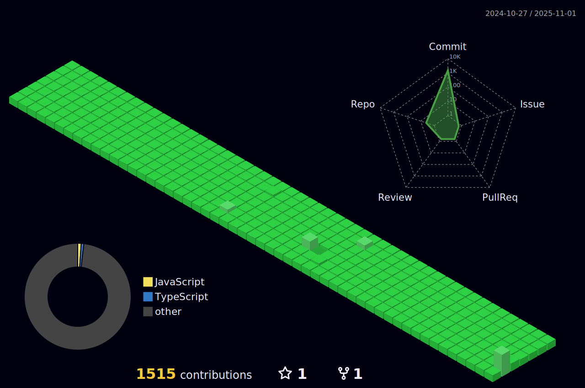

<body>
  

    <h1> Hi there, I'm MrSohaibAhmed  <a href="href="https://github.com/MrSohaibAhmed""></h1>
  

  

### 👨‍💻 Skill Trainer at House of Professionals
<!-- - 🌱 Expanding knowledge in WEB 3.0. -->
- 👯 I’m looking to collaborate with other content creators and developers.
- 📢 Passionate about teaching and inspiring students; taught over 100.
- 🥅 2023-24Goals: Contribute more to Open Source projects and execute innovative ideas.
- 💎 Let's connect if you're a tech enthusiast!  
 
 
  
 
 

  
  
  
  

 
   

 
<h1>Tech Stack  
 </h2>
</h1>

<table width="100">
<tr>
    <td align='center' width="200">
        
    </td>
 <td align='center' width="200">
        
    </td>
	 <td align='center' width="200">
        
    </td>
	 <td align='center' width="200">
        
    </td>
<td align='center' width="200">
        
    </td>
</tr>
 
<tr>
    <td align='center'>
        
    </td>
    <td align='center'>
        
    </td>
 <td align='center'>
        
    </td>
     <td align='center'>
        
    </td>
    <td align='center'>
        
    </td>
</tr>
 
<tr>
    <td align='center'>
        
    </td>
    <td align='center'>
        
    </td>
 <td align='center'>
        
    </td>
  <td align='center'>
        
    </td>
    <td align='center'>
        
    </td>
</tr>
    
</table>

###
 
 

 
 <h2>⚡️GitHub Analytics
 </h2>

  

 
	

<!-- ## 🚀Github Metrics

	

  -->

## ⚡️Github Contributions
	
<h4 align="center">Isometric view of contributions in the last year</h4>

	

## 🐛Github Magic Game

 

<h2 >🏆 GitHub Profile Trophy</h2>

 
  Views 
  

 
